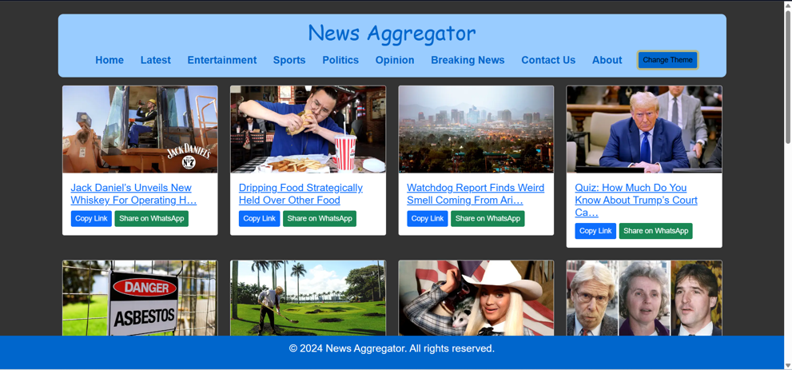
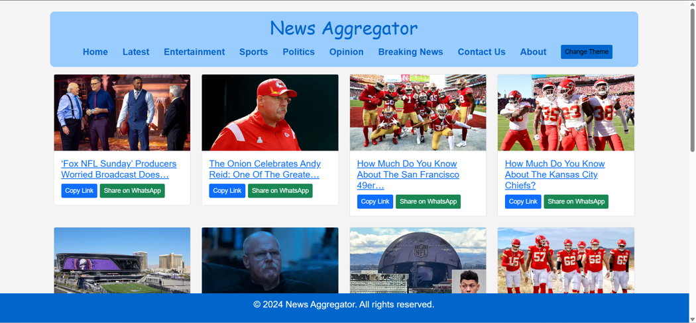
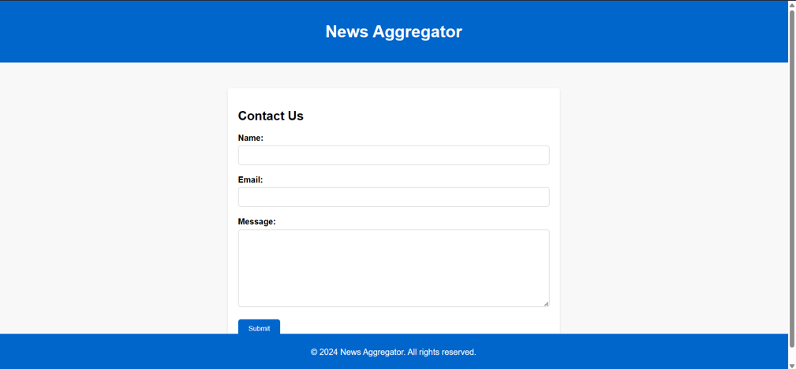

</p>
<h1 align = 'center'>News Aggregator</h1>
<br>

<br>

[](https://www.python.org "Python3")[](https://www.djangoproject.com/ "Django")

</p>
# 🗞️ News Aggregator

A Django-powered news aggregator that scrapes and displays articles from [The Onion](https://www.theonion.com). This project combines web scraping with dynamic web presentation to deliver categorized satire news articles in a clean and accessible format.

---

## 🔍 Features

- Scrapes the latest articles using `BeautifulSoup` and `requests`
- Stores article titles, images, and links in a SQLite database
- Displays categorized news (Latest, Entertainment, Sports, Politics, Opinion, Breaking News)
- Responsive frontend with Bootstrap styling
- Interactive UI with a "Load News" button to fetch data seamlessly

---

## 🖼️ Screenshots

| Latest | Entertainment | Contact Us | Dark Theme |
|--------|---------------|------------|------------|
|  |  |  |  |

---

## 🚀 How to Use

### 📦 Installation

Make sure you have Python 3 installed. Then run:

```bash
pip install bs4
pip install requests
pip install django-social-share

---

### **🛠️ Running the Project**

1. Navigate to the project root (where manage.py is located).

2. Run the server:

```bash
python manage.py runserver

3. Open your browser and go to
 http://127.0.0.1:8000/

---

### **🧰 Tech Stack**
Layer	Technology
Backend	Python, BeautifulSoup
Framework	Django
Database	SQLite3
Frontend	HTML, CSS, Bootstrap

---

### **📁 Project Structure**

newsaggregator/ – Django app for crawling and rendering news

templates/ – HTML templates for views

db.sqlite3 – Database file

requirements.txt – Dependency list

---

### **👤 Author**
Created by Abhay Kumar. Feel free to fork, contribute or drop a ⭐ if you find it useful!
